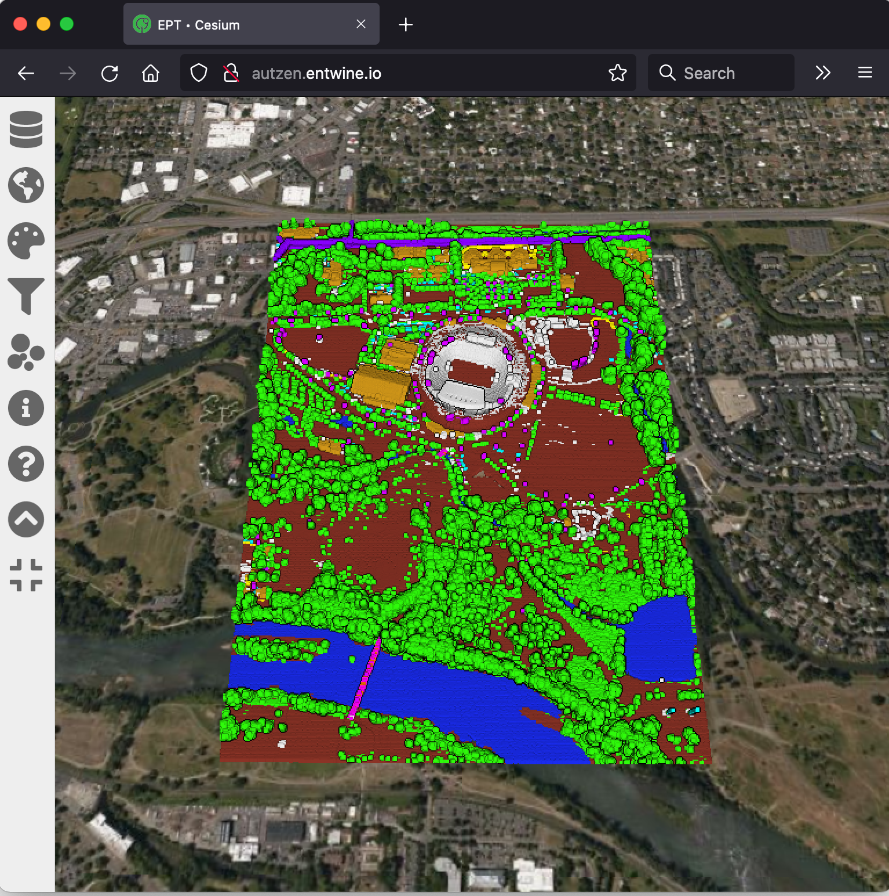

# Autzen Stadium LiDAR files

The Autzen Stadium LiDAR data was provided by Aaron Reyna of
Watershed Sciences, Inc. in 2010 as part of libLAS data testing
activities. It provides an excellent mix to test multiple dimensions
of [ASPRS LAS](https://github.com/ASPRSorg/LAS) data content and format.
Some of the things it has examples of include:

* Coordinates in us-ft due its coordinate system
* Complex buildings and structures
  * Stadium
  * Baseball park
  * Odd shapes
  * Other infrastructure
* A full compliment of LAS data members including PointSourceId, Red, Green, Blue,
  Intensity, and UserData. See [PDAL Dimensions](https://pdal.io/dimensions.html)
  for possibilities.
* Convenient testing size – 10,653,336 points is big enough to matter, but small enough to transmit (66mb)

## Updated Classifications

In 2021, Max Sampson of [Hobu, Inc](https://hobu.co) manually classified 21
categories of objects on the original Autzen.laz file. This file is called ``autzen-classified.laz``
and is available for download at [https://github.com/PDAL/data/blob/main/autzen/autzen-classified.laz](https://github.com/PDAL/data/blob/main/autzen/autzen-classified.laz).

| Value | Description            |
| ----- | -----------------------|
| 2     | Ground                 |
| 5     | Vegetation             |
| 6     | Building               |
| 9     | Water                  |
| 15    | Transmission Tower     |
| 17    | Bridge Deck            |
| 19    | Overhead Structure     |
| 64    | Wire                   |
| 65    | Car                    |
| 66    | Truck                  |
| 67    | Boat                   |
| 68    | Barrier                |
| 69    | Railroad Car           |
| 70    | Elevated Walkway       |
| 71    | Covered Walkway        |
| 72    | Pier/Dock              |
| 73    | Fence                  |
| 74    | Tower                  |
| 75    | Crane                  |
| 76    | Silo/Storage Tank      |
| 77    | Bridge Structure       |

## autzen.entwine.io

### [Autzen Stadium](https://en.wikipedia.org/wiki/Autzen_Stadium) 2010 LiDAR

``autzen-classified.laz`` data from the [Hobu, Inc](https://hobu.co) team are
available for bulk download from [https://github.com/PDAL/data/tree/main/autzen](https://github.com/PDAL/data/tree/main/autzen) and viewable at [http://autzen.entwine.io](http://autzen.entwine.io).
